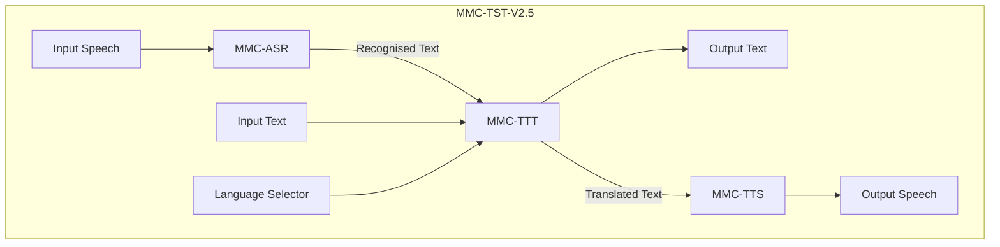
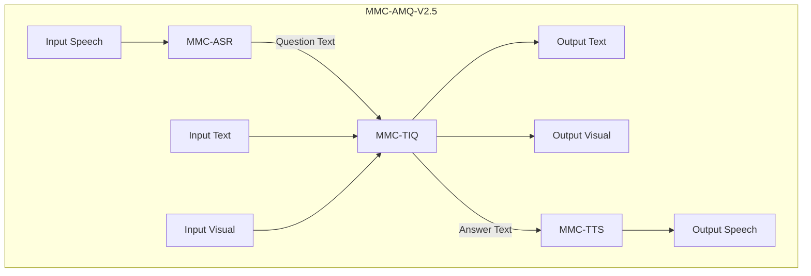
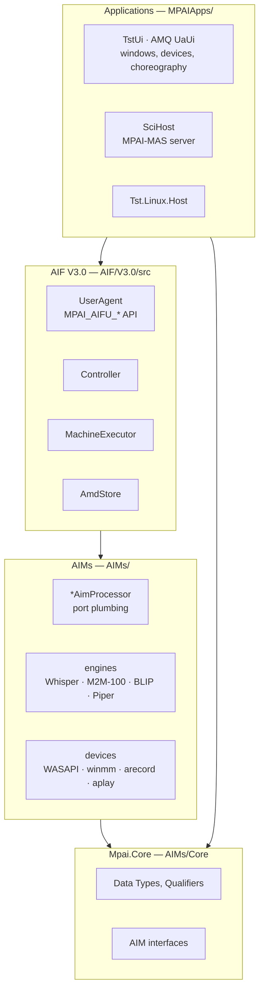
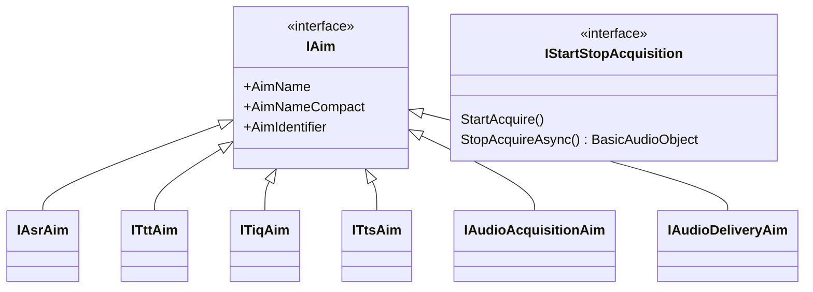
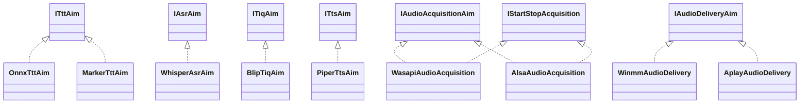
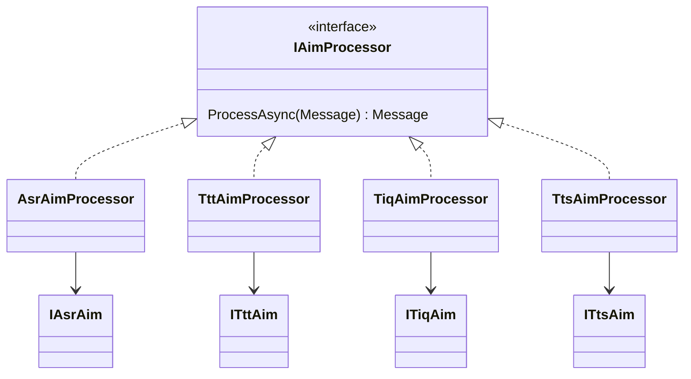
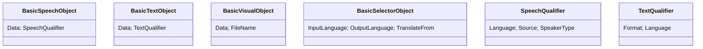
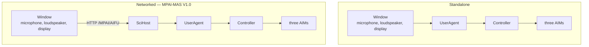

# MPAI reference applications: software architecture

MMC-TST-V2.5 and MMC-AMQ-V2.5 on MPAI-AIF V3.0. August 2026.

For a reader who wants the shape of the system without reading the code. Every
claim corresponds to something in the repository, and paths are given so any of
it can be checked in one step.

## 1. Two applications, one framework

| | Text and Speech Translation | Answer to Multimodal Question |
|---|---|---|
| Composite AIM | `MMC-TST-V2.5` | `MMC-AMQ-V2.5` |
| SubAIMs | ASR, TTT, TTS | ASR, TIQ, TTS |
| Boundary in | Speech or Text, Language Selector, Media Selector | Visual, and Speech **or** Text |
| Boundary out | Text, Speech | Text, Visual, Speech |
| Engines | Whisper, M2M-100, Piper | Whisper, BLIP, Piper |

They share ASR and TTS, the whole AIF, every Data Type, and both deployment
topologies. What differs is three connections in a JSON file.

Neither diagram is expressed in code. Both are `Topology` in an AMD, and the
Controller executes them.

## 2. What belongs inside a Composite AIM

This is the load-bearing question, and it has a one-line test:

> **If it would travel with the User Agent when the User Agent becomes a Remote
> Client Application, it is not a SubAIM.**

Acquisition, presentation and delivery interact with the user *directly*. When
the application is split across a network they follow the user, not the AIF. So
Speech Object Acquisition and Delivery, and Visual Object Acquisition and
Delivery, are **User Agent modules** in these two applications.

They remain AIMs in their own right wherever they capture from or deliver to
something outside the AIF that is not the user — a microphone array observing a
scene, for instance.

Both AMDs previously declared them as SubAIMs, and the implementations disagreed:
the acquisition AIMs were configured with **file** devices while the windows
captured with their own recorders, and the delivery AIMs wrote files that the
windows read back and played. Two components claimed one responsibility and one
of them was decorative. The AMDs now say what the code always did.

The consequence is visible in the MAS deployment, and is the proof of the rule: a
server has no microphone, so an acquisition SubAIM there could only ever pass
through what the client had already recorded.

## 3. Layers

Dependencies point one way. Applications depend on the AIF, the AIF on the AIMs'
contracts, everything on `Mpai.Core`.

## 4. Class structure

### 4.1 The AIM contracts — `AIMs/Core/Aims.cs`

The standard name belongs to the **role**, not the engine:

`IStartStopAcquisition` is an **optional capability**: a device that can be
interrupted implements it as well, and callers test for it. That is how
press-to-stop exists on some devices and not others with no flag anywhere.

### 4.2 Engines behind the contracts

Each is chosen by a **factory** from `AIMs/aim-settings.json` and nothing else.
Swapping quantised M2M-100 for full precision, or a mobile OCR detector for a
server one, is a settings change with no code path.

### 4.3 Processors — the AIF-facing half

The split is the main thing to understand: a **processor** knows ports, Messages
and its own AMD, and nothing about models; an **engine** knows its model and
nothing about ports. Each processor reads its port names from its AMD at
construction, so a port rename is a metadata change.

### 4.4 Data Types — `AIMs/Core/Objects.cs`, `Qualifiers.cs`

Qualifiers carry what bytes cannot. Most cross-AIM behaviour is driven by them
rather than by parameters: MMC-ASR takes its language from the Speech Qualifier,
MMC-TTS picks its voice from the Text Qualifier.

## 5. Execution

`MachineExecutor` walks the Topology:

| Concern | Mechanism |
|---|---|
| Which AIM receives a value | matched by **DataType** |
| Two ports of one type on one AIM | **PortNumber** — TST's `InputText` is 1, `RecognisedText` is 2 |
| A boundary input that may be absent | **IsOptional** — the AIM is *skipped*, which is how a typed question skips MMC-ASR |
| A boundary input that must be waited for | absent and not optional — the run **suspends**, naming the port |
| Stop | `AimContext.StopToken` |
| Pause and Resume | `AimContext.PauseGate` plus a `PauseRequests` count |

**Neither application suspends any more.** TST never did. AMQ did — the AIW
asked for the question after receiving the image — and that had to go, because
the workflow shows the user a *frame built by MMC-TIQ* before inviting the
question, while an AIM appears once in a Topology and the plan is one ordered
pass. No AMD can express build-frame, ask, then answer. Since showing an image
and inviting a question are user-facing acts, they moved to the User Agent, and
image and question now arrive together.

That also settled the typed question. Suspension can support one modality or the
other, never a choice between them: whichever port the run waits on, the other
can never arrive. With both arriving at once, both question Ports are optional
and MMC-ASR is simply skipped when the question is typed.

## 6. Deployment

One line of configuration chooses between them — `MasServerUrl`, or `--mas <url>`
on the command line. **The devices are in the same place in both**, which is what
the SubAIM rule bought: the only difference between the two topologies is where
the AIF runs.

Wire format is `MPAIApps/MAS/Mpai.Mas.Rca`: `MasApiClient` speaks MPAI-MAS V1.0,
`MpaiPortData` translates Objects to port-data, `MpaiSelectorData` and
`MpaiQualifierData` add the Selector and the qualifier inverse.

## 7. Zero trust

The AIF's guarantee is that the **Controller** mediates: it instantiates AIMs
from metadata, routes between them per the Topology, and nothing else may.

The User Agent lives *outside* the AIF and is granted the `MPAI_AIFU_*` API. A UA
holding a microphone is therefore not a breach — supplying a Speech Object at a
boundary Port is what the Port is for. A UA reaching *past* that API is.

Fixed:

- **`UserAgent.TryGetRuntime` removed.** It handed out an AIW's `AimHost` and
  `PortRegistry`, which let a choreography register an AIM into a running AIW and
  invoke it outside the Topology. Its one caller needed MMC-OCR, which is not a
  SubAIM of AMQ; that call has gone with it.
- **Acquisition and delivery removed from both AMDs**, as above.

Open:

- **Every AIM project references `AIF.Controller` and `AIF.Store`.**
  `IAimProcessor` and `Message` come from the Controller; `AmdStore` is read by
  each processor for its own port names. An AIM shipped as an independent binary
  drags the Controller with it. The fix is a contracts assembly plus port-name
  injection.
- **`AoeAim` and `AseAim` use `AIF.SharedStorage` directly** rather than through
  the Controller. M3124 proposes `MPAI_AIFM_SharedStorage_Put/Get`, which would
  make this an implementation of the specification rather than an invention.
- **CAE-ASM is not executed by the Controller at all.** Its own AMD says so:
  ASMApp calls directly into live AIM instances and the Topology is
  documentation. That is the largest remaining exception.

## 8. Where platform-specific code lives

Two places, each a two-line choice of device: `TstProvider.cs` and
`LocalAudio.cs`. Everything else — windows, Controller, AIMs, engines — is
platform neutral. `Tst.Linux.Host` is a different provider and nothing else.

## 9. File map

| Path | Contains |
|---|---|
| `AIF/V3.0/src/AIF.Controller` | Controller, MachineExecutor, UserAgent, AimLifecycle, RuntimePort |
| `AIF/V3.0/src/AIF.Store` | AmdStore, AimSettings |
| `AIMs/Core` | Data Types, Qualifiers, AIM interfaces |
| `AIMs/MMC/V2.5/{ASR,TTT,TIQ,TTS,SOA,SOD,OCR}` | one folder per AIM: processor, engines, factory |
| `AIMs/CAE3/V1.0/AOA{,.Windows}`, `AOD{,.Windows}` | device implementations |
| `AIMs/AMDs/*.json` | AIM Metadata, level 3 |
| `AIMs/aim-settings.json` | model paths, voices, engine selection |
| `MPAIApps/TST/TstUi`, `MPAIApps/AMQ/UaUi` | the two applications |
| `MPAIApps/MAS/{SciHost,Mpai.Mas.Rca}` | MPAI-MAS server and client library |
| `MPAIApps/TSTApp` | built demo and builder |

## 10. Known debt

1. **`SciHost` is an AMQ demo serving two AIWs.** Its banner and output folder
   still say AMQ. Three faults found while adding TST came from that: a missing
   AIM in its provider, an AMQ-shaped two-step run that discarded TST's inputs,
   and a port translator that dropped the Speech Qualifier.
2. **Absolute paths.** `aim-settings.json` and `Build-TST.bat` name one machine's
   drives. A clone does not run until both are repointed.
3. **Recognised Text does not cross the composite boundary**, so in MAS mode the
   client cannot show what was heard, and mis-hearing looks like mis-translating.
4. **No Formality on the Selector.** A translator cannot be correct in Italian,
   German, French, Japanese or Korean without knowing the register, and nothing
   carries it. A Data Type question for MPAI-MMC.