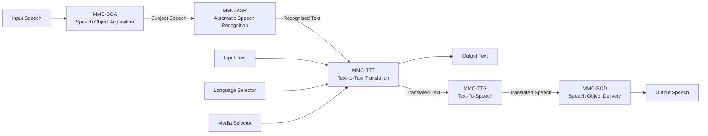
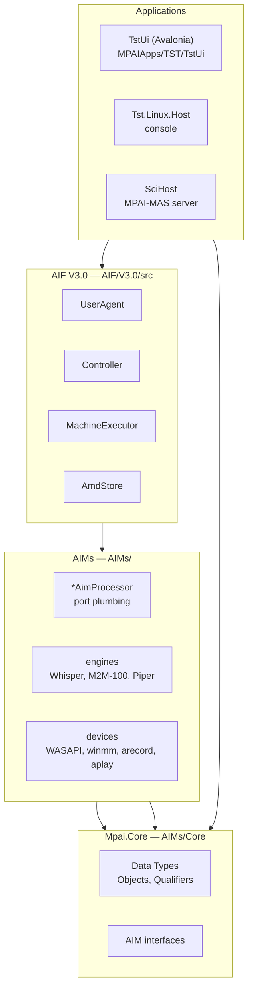
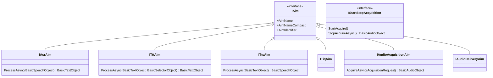
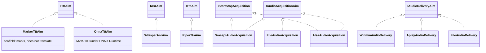
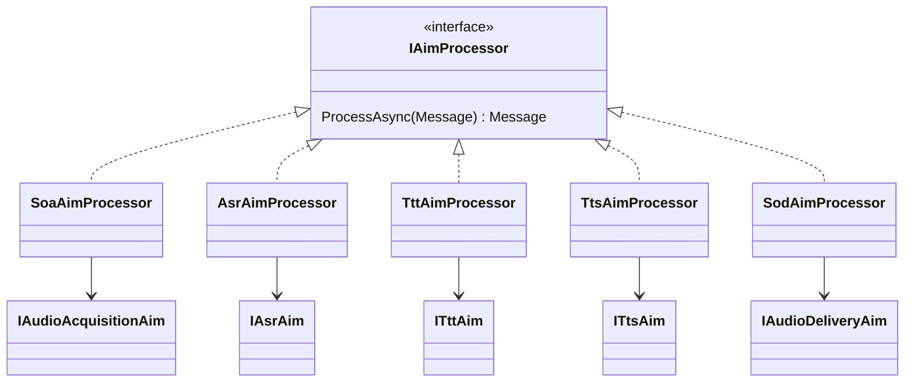
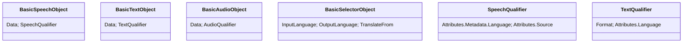
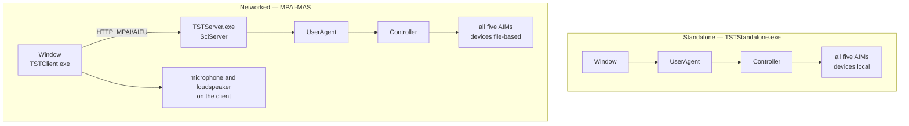

# MPAI-TST software architecture

Reference implementation of MMC-TST-V2.5 on MPAI-AIF V3.0. August 2026.

Written for a reader who wants the shape of the system without reading the code.
Every claim below corresponds to something in the repository; file paths are
given so any of it can be checked in one step.

## 1. What the system is

A **Composite AIM** — Text and Speech Translation — built from five SubAIMs, run
by an AIF Controller that reads metadata and knows nothing about translation.

Nothing in that diagram is expressed in code. It is `Topology` in
`AIMs/AMDs/1MMC-TST-V2.5-I01.json`, and the Controller executes it. The User
Agent writes the boundary ports, starts the AIW and reads the outputs; it names
no AIM and touches no device.

## 2. Layers

The dependency direction is the design: applications depend on the AIF,
the AIF on the AIMs' contracts, everything on `Mpai.Core`. Nothing points back.

## 3. Class structure

### 3.1 The AIM contracts — `AIMs/Core/Aims.cs`

Every AIM interface lives here, with the standard name attached to the **role**
rather than to the engine:

`IStartStopAcquisition` is an **optional capability**: a device that can be
interrupted implements it as well, and MMC-SOA tests for it. That is how
press-to-stop exists on some devices and not others without a flag anywhere.

### 3.2 Engines behind the contracts

Each engine is chosen by a **factory** from deployment settings:
`TttFactory`, `AsrFactory`, `TtsFactory`. A factory reads
`AIMs/aim-settings.json` and nothing else; swapping the quantised M2M-100 for
the full-precision one is a settings change with no code path.

### 3.3 Processors — the AIF-facing half

The split is deliberate and is the main thing to understand about the code:

- a **processor** knows about ports, Messages and its own AMD, and nothing about
  translation or audio hardware;
- an **engine** knows about its model or device, and nothing about ports.

Each processor reads its own port names from its AMD at construction, so a port
rename is a metadata change.

### 3.4 Data types — `AIMs/Core/Objects.cs`, `Qualifiers.cs`

Qualifiers carry what the bytes cannot: language, source (`Real` or
`Synthetic`), speaker properties, format. Most cross-AIM behaviour in this system
is driven by them rather than by parameters — MMC-ASR takes its language from the
Speech Qualifier, MMC-TTS picks its voice from the Text Qualifier.

## 4. Execution

`MachineExecutor` (`AIF/V3.0/src/AIF.Controller`) walks the Topology:

| Concern | Mechanism |
|---|---|
| Which AIM receives a value | matched by **DataType** |
| Two ports of the same type on one AIM | disambiguated by **PortNumber** — `InputText` is 1, `RecognisedText` is 2 |
| A boundary input that may be absent | `IsOptional` — the AIM is **skipped**, not suspended, which is how a text-only request bypasses SOA and ASR |
| Stop | `AimContext.StopToken` |
| Pause and Resume | `AimContext.PauseGate` plus a `PauseRequests` count |

Press-to-stop recording is built from Pause: the User Agent calls
`MPAI_AIFU_AIW_Pause` then `_Resume`, MMC-SOA sees the count change and closes
the microphone, and the pipeline continues. Stop would have ended the AIW and
discarded the recording.

## 5. Deployment

Two topologies, one code base.

The switch is one line of `tst-config.json` — `MasServerUrl`, empty for
standalone — or `--mas <url>` on the command line.

In MAS mode the **client** holds the devices, because the server has none. This
is not a breach of the AIF boundary: a Remote Client Application sits outside the
AIF, and the boundary being protected is the server's Controller. It is also how
AMQ answered the same question.

Wire format is `Mpai.Mas.Rca`: `MasApiClient` speaks MPAI-MAS V1.0,
`MpaiPortData` translates Objects to port-data, `MpaiSelectorData` and
`MpaiQualifierData` add the Selector and the qualifier inverse that TST needed.

## 6. Where platform-specific code lives

Exactly two places, both a two-line choice of device:

- `MPAIApps/TST/TstUi/TstProvider.cs`
- `MPAIApps/TST/TstUi/LocalAudio.cs` (remote mode only)

Everything else — window, Controller, AIMs, engines — is platform neutral. That
is the direct payoff of putting devices in edge AIMs: `Tst.Linux.Host` is a
different provider and nothing else.

## 7. File map

| Path | Contains |
|---|---|
| `AIF/V3.0/src/AIF.Controller` | Controller, MachineExecutor, UserAgent, AimLifecycle, RuntimePort |
| `AIF/V3.0/src/AIF.Store` | AmdStore, AimSettings |
| `AIMs/Core` | Data Types, Qualifiers, AIM interfaces |
| `AIMs/MMC/V2.5/{SOA,ASR,TTT,TTS,SOD}` | one folder per AIM: processor, engines, factory |
| `AIMs/CAE3/V1.0/AOA{,.Windows}`, `AOD{,.Windows}` | device implementations |
| `AIMs/AMDs/*.json` | AIM Metadata, level 3 |
| `AIMs/TextAndSpeechTranslation.json` | AIM Metadata, level 2 |
| `AIMs/aim-settings.json` | deployment settings: model paths, voices |
| `MPAIApps/TST/TstUi` | the Avalonia application |
| `MPAIApps/MAS/{SciHost,Mpai.Mas.Rca}` | MPAI-MAS server and client library |
| `MPAIApps/TSTApp` | the built demo and its builder |

## 8. Known design debt

Stated plainly, because a reviewer will find these anyway:

1. **SciHost is an AMQ demo serving a second AIW.** Its banner, its output folder
   and its provider were written for Answer to Multimodal Question. Three faults
   found while adding TST came from that: a missing AIM in the provider, an
   AMQ-shaped two-step run that discarded TST's inputs, and a port translator
   that dropped the Speech Qualifier. Making it genuinely AIW-agnostic is the
   next real piece of work if MAS is to be more than a demonstration.

2. **`aim-settings.json` holds absolute paths**, as does `ROOT` in
   `Build-TST.bat`. A clone on another machine does not run until both are
   repointed. A template plus a setup script is the fix.

3. **Recognised Text does not cross the composite boundary.** It is internal, so
   in MAS mode the client cannot show what was heard — and mis-hearing then looks
   exactly like mis-translating. A boundary output would fix it; the figure has
   no reason to expose it, which is a specification question rather than a bug.

4. **Zero-trust exceptions remain elsewhere in the repository**: some AIMs
   reference `AIF.Controller` and `AIF.Store` directly, `AIF.SharedStorage` is
   used by AOE and ASE without the Controller, and `AmqWorkflow` bypasses the
   Controller through `TryGetRuntime`. None of these are on TST's path.

5. **No Formality on the Selector.** A translator cannot be correct in Italian,
   German, French, Japanese or Korean without knowing the register, and nothing
   carries it. This is a Data Type question for MPAI-MMC.